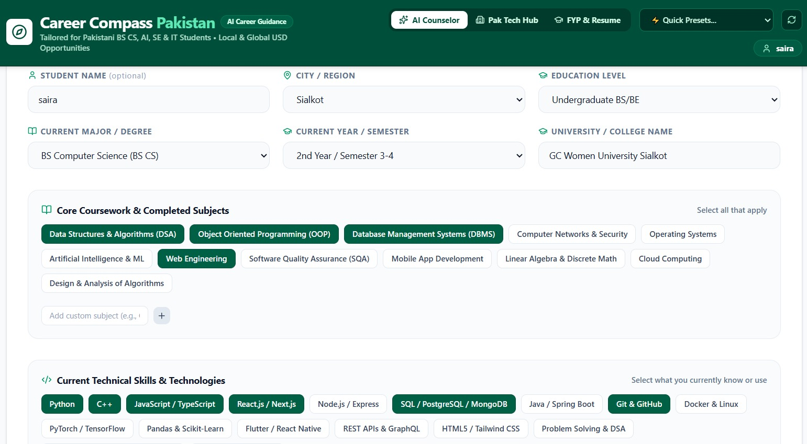
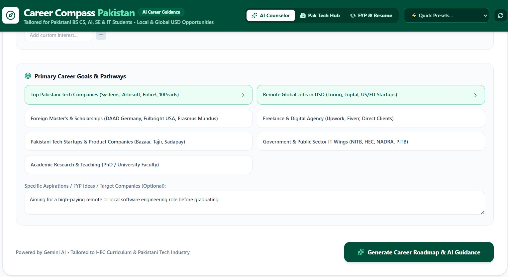
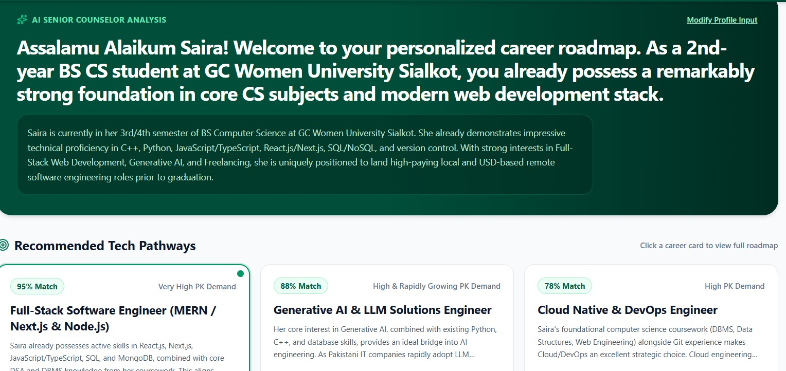
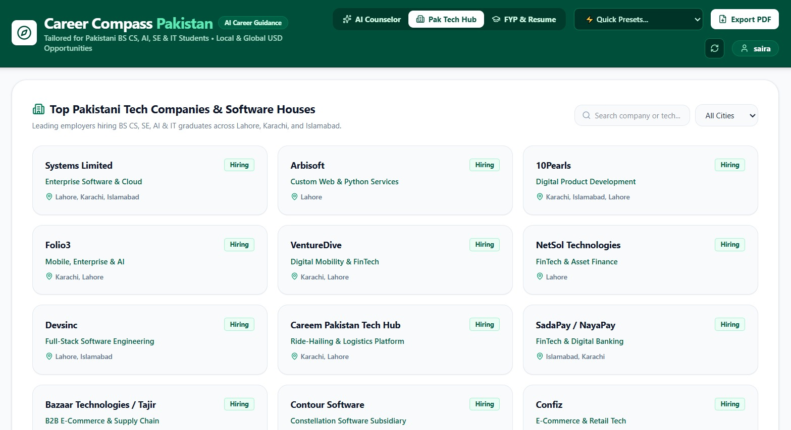

# Career Compass Pakistan – AI Career Guidance Platform

## Overview

Career Compass Pakistan is an AI-powered career guidance platform designed to help Pakistani students choose suitable career paths based on their education, skills, interests, and goals.

The platform uses Artificial Intelligence to analyze student profiles and generate personalized career recommendations, skill development plans, and learning roadmaps.

## Features

- AI-based personalized career recommendations
- Student profile analysis
- Career roadmap generation
- Skills and interests assessment
- Learning resources and certification suggestions
- Pakistan-focused career guidance
- Modern and user-friendly interface

## Technologies Used

- Google AI Studio (Gemini AI)
- React
- JavaScript / TypeScript
- HTML & CSS
- AI Prompt Engineering

## AI Prompt

The AI works as an expert career counselor for Pakistani students. It analyzes students' educational background, skills, interests, and career goals to provide suitable career options, required skills, learning roadmaps, and professional guidance.

## Screenshots

## Screenshots

### Student Profile Screen

### Select Primary Goals

### Generate Career Roadmap

### Step-by-Step Learning Roadmap

### Top Pakistan Tech Hubs

## Project Goal

The goal of this project is to help students in Pakistan explore suitable career opportunities and make better career decisions using Artificial Intelligence.

## Developed For

HEC ACT AI Final Project
